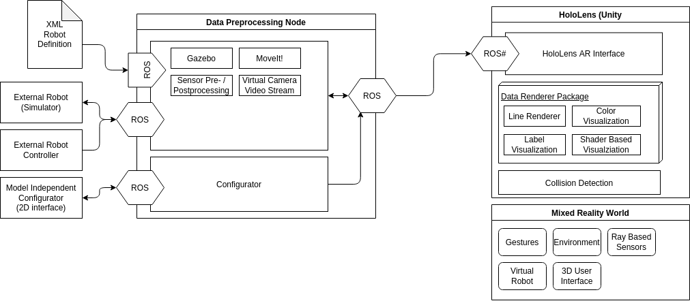
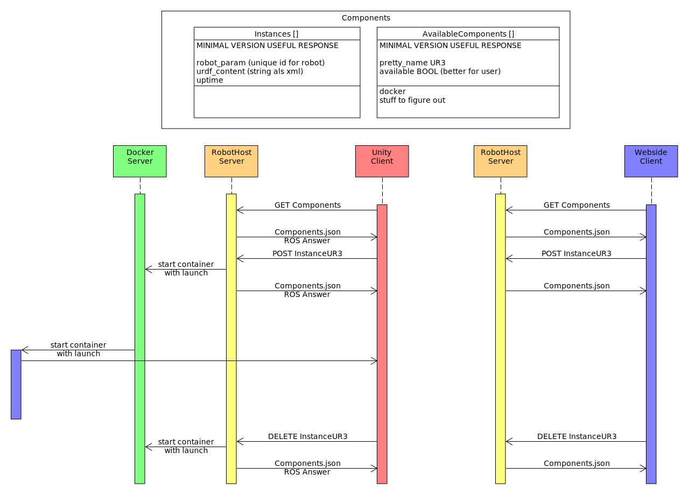

# 3D_Vision_AR_RobotVis

# AR-Manager Overview

# Docker 
[Installation Tutorial](https://docs.docker.com/install/linux/docker-ce/ubuntu)
## Docker commands:
```docker build -t nice_image_name:1.0 .```
`-t` tages image with name; . navigates to where Dockerfile is located(here in same dir)

```docker run ros1_base:1.0```
`-d` for detached. It is running in the background
`-i` interactive
`-it` interactive and attached to terminal
`-network=host` run the container in non-isolated network. (same as on your host PC)
`-p 80:5000` maps port 80 of docker host to port 5000 of docker container
`-v ./shared_volume:/home/shared_volume` maps folder at ./shared_volume form host to /home/shared_volume in container

```docker ps``` let's you see all runing containers
'-a' even stoped ones

```docker stop ID/Name```  
```docker rm ID/Name```

```docker exec ID/Name```
```docker exec -it ID/Name bash ``` Executes a second shell in running container

```sudo docker system prune``` deletes all cache files 
`-a` also all images
## Structure
### Design Considerations ROS
Every ROS-node will belong to a single container. 
Three different base images are provided for ROS1, ROS2, ROS1+2
This allows to develop on a single node without risking to break anything.
Modules are clearly seperated. 
Communication within the containers is done by highly optimized Docker Container Networking Model.
Different network isolation options between the Host and Containers are available.

If you want to create or modify a new ROS-Node simply take one of the base images and modify it.

Simplest way to go is copy for example `ros2_example` folder and rename it.
(Make sure to use the `FROM` command to create new base image)  
Create and `newNode_install.sh` file in this folder.  
Build the container and run it with the volume mapped so you can modify the `newNode_install.sh` with VSCode. (Use argument `docker run -v`) Do the bugfixing and debugging until the new node works. Therefore use the `newNode_install.sh` for all installation purposes. (`chmod +x newNode_install.sh`). When finished simply add the script to the Dockerfile (see for example ros2_gazebo). If you want to develop a ROS node to the same simply map a workspace between the node and your host PC with the `docker run -V` and do the development in VSCode. 
### Dockerfile 

Install all containers:
''' 
docker build --no-cache -t ros1_base ./ros1_base/ &&\
docker build --no-cache -t ros1_ur ./ros1_ur/ &&\
docker build --no-cache -t ros1_ur_rossharp ./ros1_ur_rossharp/
'''


[Dockerfile Best Practices](https://docs.docker.com/develop/develop-images/dockerfile_best-practices/)
[Dockerfile Reference](https://docs.docker.com/engine/reference/builder/)
### Docker compose up/down
The compose command builts and runs all services/container specified in the docker-compose.yml
Similar to ansible
`docker-compose up -d`
[docker-compose Reference](https://docs.docker.com/compose/compose-file/)

#### ros1_2_bridge 
Is the bridge between ROS1 and ROS2. Problem we have to write interface nodes in ROS1 aswell as ROS2 in this docker-container

#### ros2_moveit 
We can use MoveIt2! in ROS2 here. 
Add here lauch files for different robots. (Not sure how good this is working)
Alternative we can use MoveIt! in ROS1

#### ros1_ros-sharp 
Includes the bridge to Unity.

### Useful link:
[Really nice Project ROS/Docker ETH](https://github.com/gramaziokohler/ros_docker)
[Writing Bash Scripts:](https://devhints.io/bash)
[ROS1 Training](https://industrial-training-master.readthedocs.io/en/melodic/_source/session1/Installing-Existing-Packages.html)
[Unix Shell Overview](https://swcarpentry.github.io/shell-novice/reference/)


# Literature:
Docker and ROS Tutorial: https://link.springer.com/chapter/10.1007/978-3-319-54927-9_9


